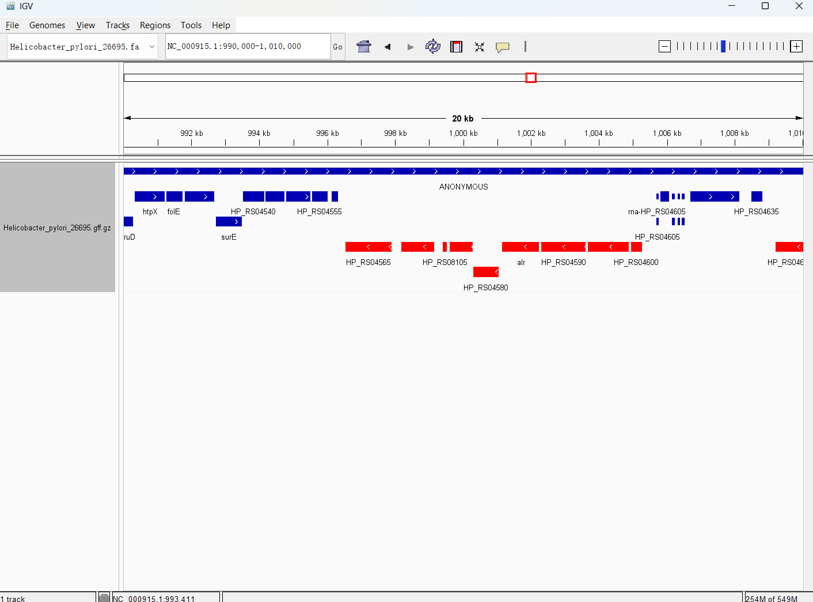
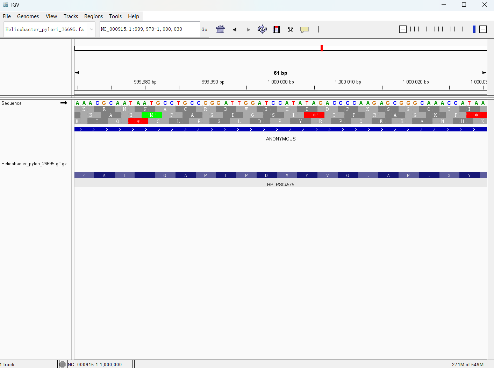
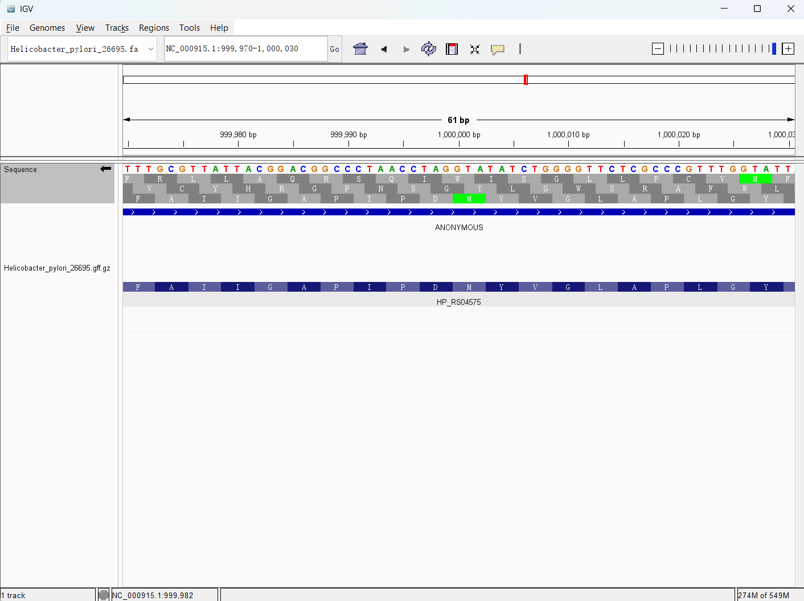

# Week 2: Visualize Genomic Data

## Genome selected

I selected the complete RefSeq genome for **Helicobacter pylori 26695**.

- Organism: `Helicobacter pylori 26695`
- RefSeq assembly: `GCF_000008525.1_ASM852v1`
- Assembly name: `ASM852v1`
- Data source: NCBI RefSeq FTP
- FASTA: `GCF_000008525.1_ASM852v1_genomic.fna.gz`
- GFF: `GCF_000008525.1_ASM852v1_genomic.gff.gz`

This genome is not the same genome used in the instructor example.

## How to reproduce

This assignment uses the course pixi environment at `$HOME/edu/bioinfo`.

From this directory, run:

```bash
pixi run -m "$HOME/edu/bioinfo" make all
```

The `Makefile` downloads the FASTA and GFF files, indexes the FASTA, prepares a sorted tabix-indexed GFF for IGV, and writes `reports/summary.tsv`.

Files are organized by type:

- `fasta/`: FASTA and `.fai`
- `gff/`: raw GFF, IGV-ready GFF, and `.tbi`
- `reports/`: summary table

The main files for IGV are:

- `fasta/Helicobacter_pylori_26695.fa`
- `fasta/Helicobacter_pylori_26695.fa.fai`
- `gff/Helicobacter_pylori_26695.gff.gz`
- `gff/Helicobacter_pylori_26695.gff.gz.tbi`

## Genome and annotation summary

NCBI reports this assembly as a **complete genome** with full genome representation.

- Genome size: `1,667,867 bp`
- Number of chromosomes: `1`
- Number of scaffolds: `1`
- Gaps: `0`
- GC content: about `39%`
- GFF annotation rows counted locally: `3,253`
- Gene rows counted locally from the GFF third column: `1,495`

I consider this build complete for this assignment because it is a single-chromosome bacterial genome with one scaffold and no gaps. One caveat is that NCBI notes many frameshifted proteins, so the genome assembly is complete but some protein annotations should be interpreted carefully.

## IGV visualization

To visualize the genome:

1. Run `pixi run -m "$HOME/edu/bioinfo" make all`.
2. Open IGV.
3. Load `fasta/Helicobacter_pylori_26695.fa` as the genome.
4. Load `gff/Helicobacter_pylori_26695.gff.gz` as the annotation track.
5. In the GFF track settings, color features by strand.

## Visual inspection answers

The genes are very tightly packed, as expected for a bacterial genome. In the approximately 20 kb IGV view around `NC_000915.1:990,000-1,010,000`, many neighboring annotated features are separated by only short intergenic regions, roughly tens to a few hundred base pairs by visual inspection. The GFF features are colored by strand orientation, so forward-strand and reverse-strand features are visually distinct.

Coordinate selected for inspection:

```text
NC_000915.1:1,000,000
```

At any genomic coordinate, the base can be part of three forward-strand reading frames and three reverse-strand reading frames:

- Forward frame 1: codons grouped starting at position 1 of the displayed sequence.
- Forward frame 2: codons grouped starting at position 2 of the displayed sequence.
- Forward frame 3: codons grouped starting at position 3 of the displayed sequence.
- Reverse frame 1: codons grouped on the reverse complement starting at the first reverse-frame offset.
- Reverse frame 2: codons grouped on the reverse complement starting at the second reverse-frame offset.
- Reverse frame 3: codons grouped on the reverse complement starting at the third reverse-frame offset.

For the base-level interval `NC_000915.1:999,970-1,000,030`, I captured the three forward-strand reading frames with the sequence arrow pointing forward, then reversed the sequence orientation and captured the three reverse-strand reading frames. Together, these two views show all six possible reading frames. The translated annotated CDS shown lower in the GFF track is separate from the three generic reading frames displayed under the reference sequence.

The loaded data track is a GFF annotation track. It displays genome features such as genes, CDS records, tRNAs, rRNAs, and other annotated features. I colored features by strand orientation in IGV so that forward-strand and reverse-strand features are visually distinct.

## Screenshots



This view shows `NC_000915.1:990,000-1,010,000`. It was used to estimate gene packing and to show strand-based feature coloring.



This base-level view shows `NC_000915.1:999,970-1,000,030` with the reference sequence in the forward orientation. The three forward-strand reading frames are visible under the reference sequence.



This is the same interval, `NC_000915.1:999,970-1,000,030`, with the sequence orientation reversed. The three reverse-strand reading frames are visible.
